# ORM E-Commerce Back End

## Deployable Video Link
https://watch.screencastify.com/v/S0y0GoFteuOoIWHPw2GS

## Goal
The task was to make ORM e-commerce application that passed all routing test on Insomnia.

## Technology Use
  - Javascript
  - Node.js
  - Express
  - Mysql2
  - MySQL
  - VS Code
  - Git Bash 
  - GitHub

## Execution
Since most of the starter code was given, the first step when it came to populating the env file with user, password, and the name of the database. After doing that, the following code was dropped into the mysql:

schema.sql code:
```SQL
DROP DATABASE IF EXISTS ecommerce_db;

CREATE DATABASE ecommerce_db;
```


After inputting the following database into the MySQL system, the next step was to populate the models with the necessary models. The files given were Category, Product, ProductTag, and Tag. Each js file had their own information to fill in. 

The following code is and example code from Category model:
```Javascript
Category.init(
  {
    
    id: {
      type: DataTypes.INTEGER,
      allowNull: false,
      primaryKey: true,
      autoIncrement: true,
    },
    category_name: {
      type: DataTypes.STRING,
      allowNull: false
    },
  },
  {
    sequelize,
    timestamps: false,
    freezeTableName: true,
    underscored: true,
    modelName: 'category',
  }
);

```
Once all the model information was created, the routes had to connect to each model and each function, whether it was Put, Get, Post, and Delete request needed to be filled in order to work on Insomnia. An example of this is the code from category-routes.js is shown below:
```Javascript
const router = require('express').Router();
const { Category, Product } = require('../../models');

// The `/api/categories` endpoint

router.get('/', async (req, res) => {
  // find all categories
  try {
    const categoryData = await Category.findAll({
      // Add Product as a second model to JOIN with
      include: [{ model: Product }],
    });
    res.status(200).json(categoryData);
  } catch (err) {
    res.status(500).json(err);
  }
  // be sure to include its associated Products
});

router.get('/:id', async (req, res) => {
  // find one category by its `id` value
  try {
    const categoryData = await Category.findByPk(req.params.id, {
      // Add Product as a second model to JOIN with
      include: [{ model: Product }],
    });

    if (!categoryData) {
      res.status(404).json({ message: 'No category found with that id!' });
      return;
    }

    res.status(200).json(categoryData);
  } catch (err) {
    res.status(500).json(err);
  }
  // be sure to include its associated Products
});

router.post('/', async (req, res) => {
  // create a new category
  try {
    const categoryData = await Category.create(req.body);
    res.status(200).json(categoryData);
  } catch (err) {
    res.status(400).json(err);
  }

});

router.put('/:id', async (req, res) => {
  // update a category by its `id` value
  try {
    const categoryData = await Category.update(
      {
      category_name: req.body.category_name
    },
    {
      where: {
        id: req.params.id,
      },
    }
    )

    res.status(200).json(categoryData);
  } catch (err) {
    res.status(500).json(err);
  }
});

router.delete('/:id', async (req, res) => {
  // delete a category by its `id` value
  try {
    const categoryData = await Category.destroy({
      where: {
        id: req.params.id,
      },
    });

    if (!categoryData) {
      res.status(404).json({ message: 'No category found with that id!' });
      return;
    }

    res.status(200).json(categoryData);
  } catch (err) {
    res.status(500).json(err);
  }
});

module.exports = router;


```
Async forces the code to work and makes it possible to test on Insomnia. If it works, there is a 200 message that light up. Any other number was an error.  

There was also these two lines of code that had to be filled in so that the server could be ran. The codes are shown below:

```Javascript
const sequelize = require('./config/connection');
```
```Javascript
sequelize.sync({ force: false }).then(() => {
app.listen(PORT, () => {
  console.log(`App listening on port ${PORT}!`);
})});
 ```
The last part in order to work was to fill out the index.js within the models folder. It was the glue that connects the models to each other and essential for routes to make it work in the first place. That code is show below:

 ```Javascript
const Product = require('./Product');
const Category = require('./Category');
const Tag = require('./Tag');
const ProductTag = require('./ProductTag');

// Products belongsTo Category
Product.belongsTo(Category, {
  foreignKey: "category_id",
  onDelete: "CASCADE",
});
// Categories have many Products
Category.hasMany(Product, {
  foreignKey: "category_id"
})
// Products belongToMany Tags (through ProductTag)
Product.belongsToMany(Tag, {
  through: ProductTag,
  foreignKey: "product_id"
})
// Tags belongToMany Products (through ProductTag)
Tag.belongsToMany(Product, {
  through: ProductTag,
  foreignKey: "tag_id"
});

module.exports = {
  Product,
  Category,
  Tag,
  ProductTag,
};

```
## Result

The following website demonstrates what the final product looks like:

Get request for category:
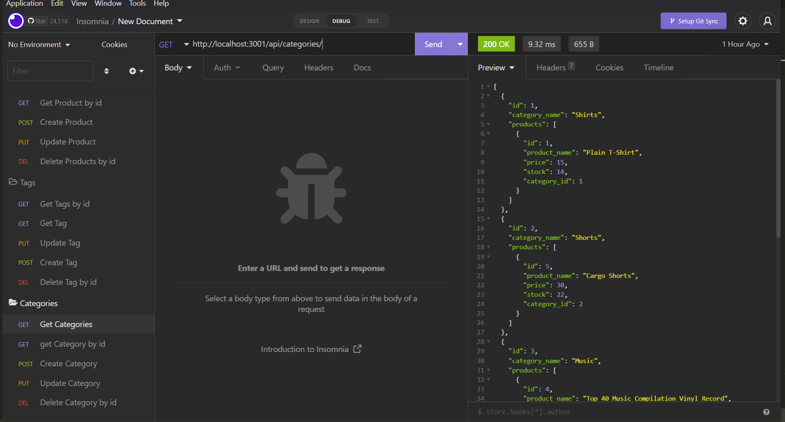

Get by id request for category:
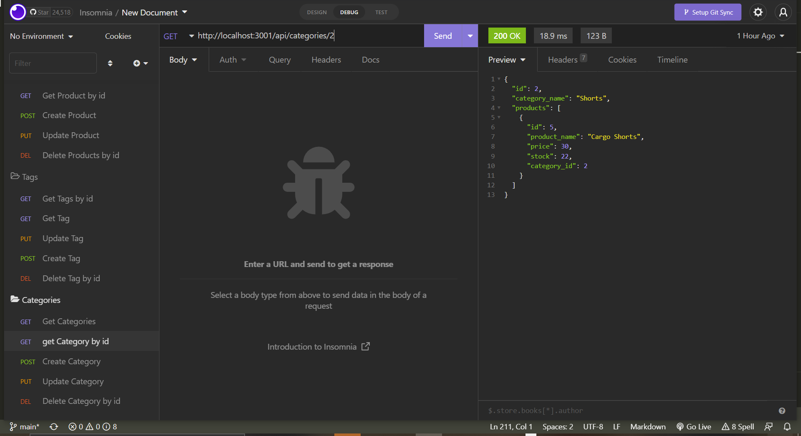

Post request for category:
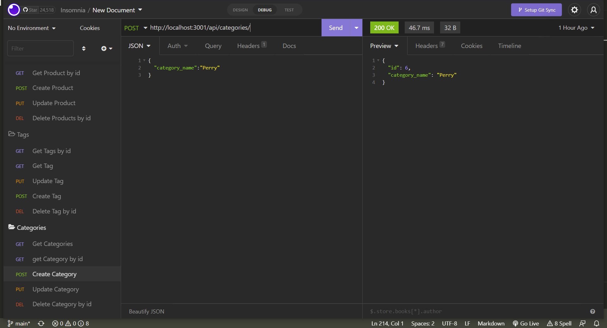

Put request for category:
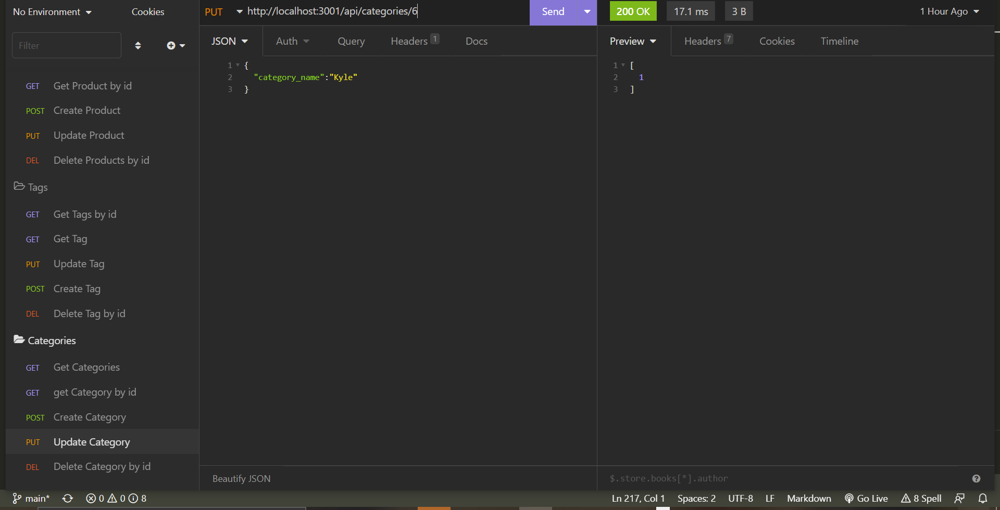

Delete request for category:
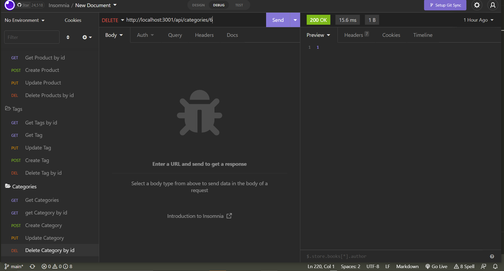


Get request for tag:
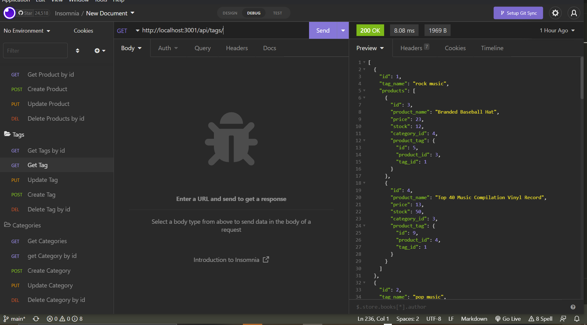

Get by id request for tag:
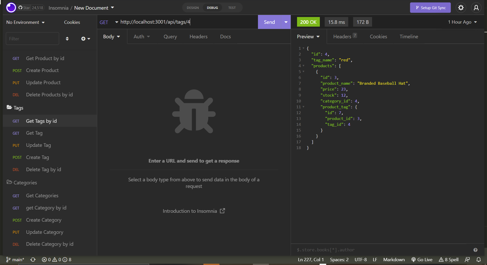

Post request for tag:
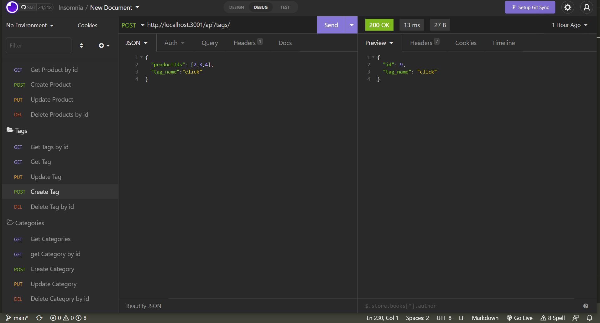

Put request for tag:


Delete request for tag:
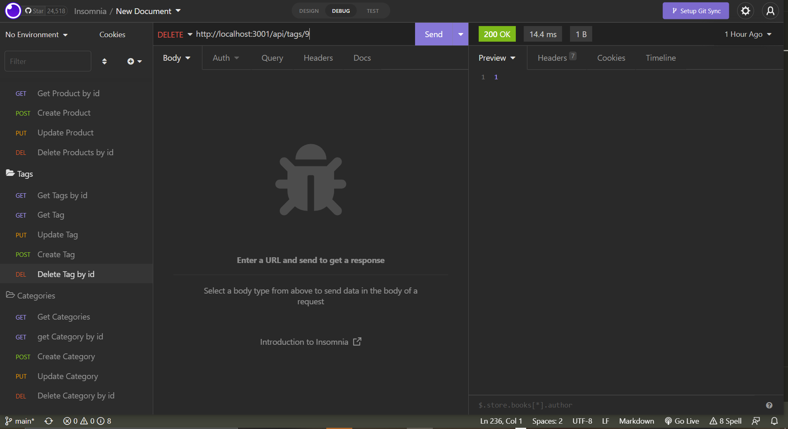


Get request for product:
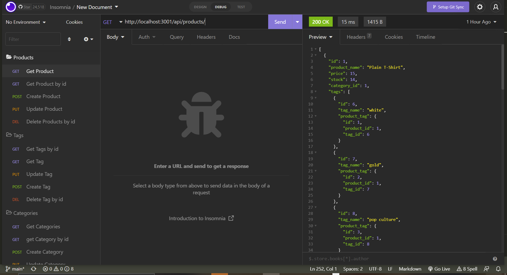

Get by id request for product:
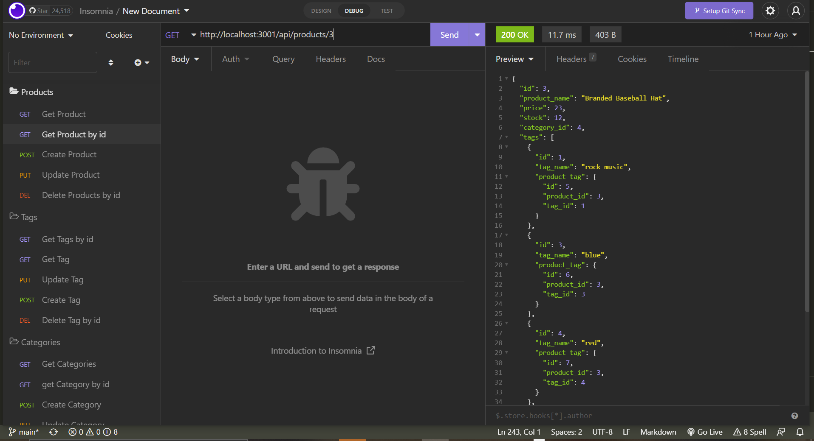

Post request for product:
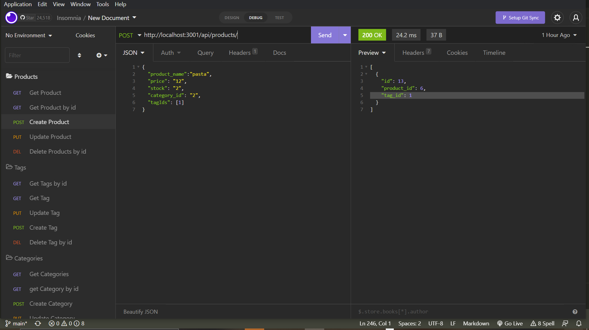

Put request for product:
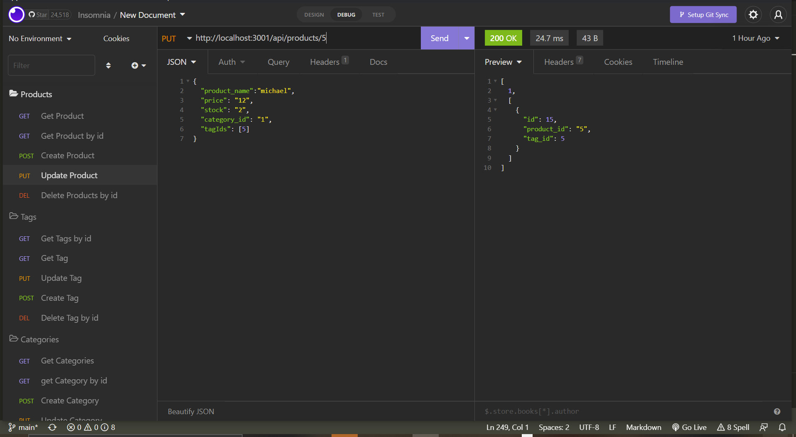

Delete request for product:
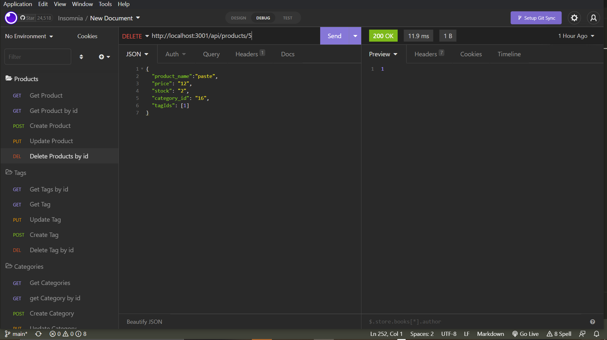


