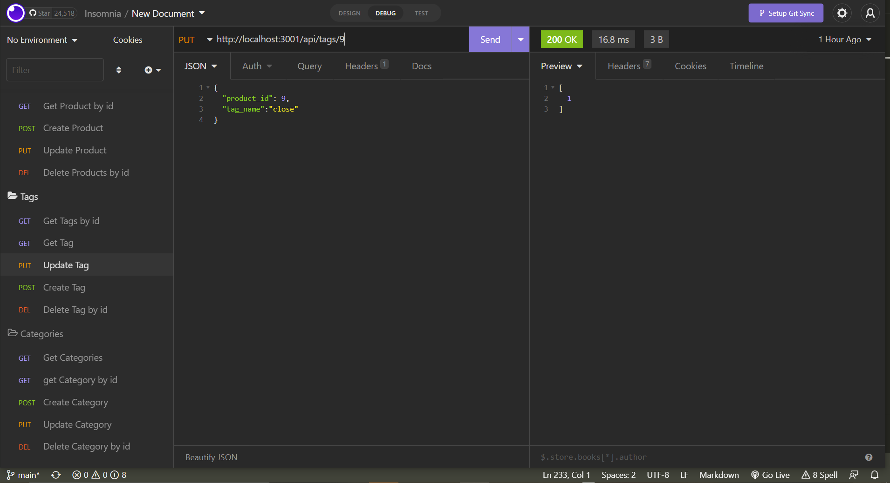

# ORM E-Commerce Back End

## Deployable Video Link
https://watch.screencastify.com/v/S0y0GoFteuOoIWHPw2GS

## Goal
The task was to make ORM e-commerce application that passed all routing test on Insomnia.

## Technology Use
  - Javascript
  - Node.js
  - Express
  - Mysql2
  - MySQL
  - VS Code
  - Git Bash 
  - GitHub

## Execution
Since most of the starter code was given, the first step when it came to populating the env file with user, password, and the name of the database. After doing that, the following code was dropped into the mysql:

schema.sql code:
```SQL
DROP DATABASE IF EXISTS ecommerce_db;

CREATE DATABASE ecommerce_db;
```


After inputting the following database into the MySQL system, the next step was to populate the models with the necessary models. The files given were Category, Product, ProductTag, and Tag. Each js file had their own information to fill in. 

The following code is and example code from Category model:
```Javascript
Category.init(
  {
    
    id: {
      type: DataTypes.INTEGER,
      allowNull: false,
      primaryKey: true,
      autoIncrement: true,
    },
    category_name: {
      type: DataTypes.STRING,
      allowNull: false
    },
  },
  {
    sequelize,
    timestamps: false,
    freezeTableName: true,
    underscored: true,
    modelName: 'category',
  }
);

```
Once all the model information was created, the routes had to connect to each model and each function, whether it was Put, Get, Post, and Delete request needed to be filled in order to work on Insomnia. An example of this is the code from category-routes.js is shown below:
```Javascript
const router = require('express').Router();
const { Category, Product } = require('../../models');

// The `/api/categories` endpoint

router.get('/', async (req, res) => {
  // find all categories
  try {
    const categoryData = await Category.findAll({
      // Add Product as a second model to JOIN with
      include: [{ model: Product }],
    });
    res.status(200).json(categoryData);
  } catch (err) {
    res.status(500).json(err);
  }
  // be sure to include its associated Products
});

router.get('/:id', async (req, res) => {
  // find one category by its `id` value
  try {
    const categoryData = await Category.findByPk(req.params.id, {
      // Add Product as a second model to JOIN with
      include: [{ model: Product }],
    });

    if (!categoryData) {
      res.status(404).json({ message: 'No category found with that id!' });
      return;
    }

    res.status(200).json(categoryData);
  } catch (err) {
    res.status(500).json(err);
  }
  // be sure to include its associated Products
});

router.post('/', async (req, res) => {
  // create a new category
  try {
    const categoryData = await Category.create(req.body);
    res.status(200).json(categoryData);
  } catch (err) {
    res.status(400).json(err);
  }

});

router.put('/:id', async (req, res) => {
  // update a category by its `id` value
  try {
    const categoryData = await Category.update(
      {
      category_name: req.body.category_name
    },
    {
      where: {
        id: req.params.id,
      },
    }
    )

    res.status(200).json(categoryData);
  } catch (err) {
    res.status(500).json(err);
  }
});

router.delete('/:id', async (req, res) => {
  // delete a category by its `id` value
  try {
    const categoryData = await Category.destroy({
      where: {
        id: req.params.id,
      },
    });

    if (!categoryData) {
      res.status(404).json({ message: 'No category found with that id!' });
      return;
    }

    res.status(200).json(categoryData);
  } catch (err) {
    res.status(500).json(err);
  }
});

module.exports = router;


```
Async forces the code to work and makes it possible to test on Insomnia. If it works, there is a 200 message that light up. Any other number was an error.  

There was also these two lines of code that had to be filled in so that the server could be ran. The codes are shown below:

```Javascript
const sequelize = require('./config/connection');
```
```Javascript
sequelize.sync({ force: false }).then(() => {
app.listen(PORT, () => {
  console.log(`App listening on port ${PORT}!`);
})});
 ```
The last part in order to work was to fill out the index.js within the models folder. It was the glue that connects the models to each other and essential for routes to make it work in the first place. That code is show below:

 ```Javascript
const Product = require('./Product');
const Category = require('./Category');
const Tag = require('./Tag');
const ProductTag = require('./ProductTag');

// Products belongsTo Category
Product.belongsTo(Category, {
  foreignKey: "category_id",
  onDelete: "CASCADE",
});
// Categories have many Products
Category.hasMany(Product, {
  foreignKey: "category_id"
})
// Products belongToMany Tags (through ProductTag)
Product.belongsToMany(Tag, {
  through: ProductTag,
  foreignKey: "product_id"
})
// Tags belongToMany Products (through ProductTag)
Tag.belongsToMany(Product, {
  through: ProductTag,
  foreignKey: "tag_id"
});

module.exports = {
  Product,
  Category,
  Tag,
  ProductTag,
};

```
## Result

The following website demonstrates what the final product looks like:

Get request for category:


Get by id request for category:


Post request for category:


Put request for category:


Delete request for category:


Get request for tag:


Get by id request for tag:


Post request for tag:


Put request for tag:


Delete request for tag:


Get request for product:


Get by id request for product:


Post request for product:


Put request for product:


Delete request for product:


<!-- # 13 Object-Relational Mapping (ORM): E-Commerce Back End

## Your Task

Internet retail, also known as **e-commerce**, is the largest sector of the electronics industry, generating an estimated $29 trillion in 2019. E-commerce platforms like Shopify and WooCommerce provide a suite of services to businesses of all sizes. Due to their prevalence, understanding the fundamental architecture of these platforms will benefit you as a full-stack web developer.

Your task is to build the back end for an e-commerce site by modifying starter code. You’ll configure a working Express.js API to use Sequelize to interact with a MySQL database.

Because this application won’t be deployed, you’ll also need to provide a link to a walkthrough video that demonstrates its functionality and all of the acceptance criteria being met. You’ll need to submit a link to the video and add it to the readme of your project.

## User Story

```md
AS A manager at an internet retail company
I WANT a back end for my e-commerce website that uses the latest technologies
SO THAT my company can compete with other e-commerce companies
```

## Acceptance Criteria

```md
GIVEN a functional Express.js API
WHEN I add my database name, MySQL username, and MySQL password to an environment variable file
THEN I am able to connect to a database using Sequelize
WHEN I enter schema and seed commands
THEN a development database is created and is seeded with test data
WHEN I enter the command to invoke the application
THEN my server is started and the Sequelize models are synced to the MySQL database
WHEN I open API GET routes in Insomnia for categories, products, or tags
THEN the data for each of these routes is displayed in a formatted JSON
WHEN I test API POST, PUT, and DELETE routes in Insomnia
THEN I am able to successfully create, update, and delete data in my database
```

## Mock-Up

The following animation shows the application's GET routes to return all categories, all products, and all tags being tested in Insomnia:


The following animation shows the application's GET routes to return a single category, a single product, and a single tag being tested in Insomnia:


The following animation shows the application's POST, PUT, and DELETE routes for categories being tested in Insomnia:


Your walkthrough video should also show the POST, PUT, and DELETE routes for products and tags being tested in Insomnia.

## Getting Started

This Challenge will require a video submission. Refer to the [Fullstack Blog Video Submission Guide](https://coding-boot-camp.github.io/full-stack/computer-literacy/video-submission-guide) for additional guidance on creating a video.

You’ll need to use the [MySQL2](https://www.npmjs.com/package/mysql2) and [Sequelize](https://www.npmjs.com/package/sequelize) packages to connect your Express.js API to a MySQL database and the [dotenv](https://www.npmjs.com/package/dotenv) package to use environment variables to store sensitive data.

Use the `schema.sql` file in the `db` folder to create your database with MySQL shell commands. Use environment variables to store sensitive data like your MySQL username, password, and database name.

### Database Models

Your database should contain the following four models, including the requirements listed for each model:

* `Category`

  * `id`

    * Integer.
  
    * Doesn't allow null values.
  
    * Set as primary key.
  
    * Uses auto increment.

  * `category_name`
  
    * String.
  
    * Doesn't allow null values.

* `Product`

  * `id`
  
    * Integer.
  
    * Doesn't allow null values.
  
    * Set as primary key.
  
    * Uses auto increment.

  * `product_name`
  
    * String.
  
    * Doesn't allow null values.

  * `price`
  
    * Decimal.
  
    * Doesn't allow null values.
  
    * Validates that the value is a decimal.

  * `stock`
  
    * Integer.
  
    * Doesn't allow null values.
  
    * Set a default value of `10`.
  
    * Validates that the value is numeric.

  * `category_id`
  
    * Integer.
  
    * References the `Category` model's `id`.

* `Tag`

  * `id`
  
    * Integer.
  
    * Doesn't allow null values.
  
    * Set as primary key.
  
    * Uses auto increment.

  * `tag_name`
  
    * String.

* `ProductTag`

  * `id`

    * Integer.

    * Doesn't allow null values.

    * Set as primary key.

    * Uses auto increment.

  * `product_id`

    * Integer.

    * References the `Product` model's `id`.

  * `tag_id`

    * Integer.

    * References the `Tag` model's `id`.

### Associations

You'll need to execute association methods on your Sequelize models to create the following relationships between them:

* `Product` belongs to `Category`, and `Category` has many `Product` models, as a category can have multiple products but a product can only belong to one category.

* `Product` belongs to many `Tag` models, and `Tag` belongs to many `Product` models. Allow products to have multiple tags and tags to have many products by using the `ProductTag` through model.

> **Hint:** Make sure you set up foreign key relationships that match the column we created in the respective models.

### Fill Out the API Routes to Perform RESTful CRUD Operations

Fill out the unfinished routes in `product-routes.js`, `tag-routes.js`, and `category-routes.js` to perform create, read, update, and delete operations using your Sequelize models.

Note that the functionality for creating the many-to-many relationship for products has already been completed for you.

> **Hint**: Be sure to look at the mini-project code for syntax help and use your model's column definitions to figure out what `req.body` will be for POST and PUT routes!

### Seed the Database

After creating the models and routes, run `npm run seed` to seed data to your database so that you can test your routes.

### Sync Sequelize to the Database on Server Start

Create the code needed in `server.js` to sync the Sequelize models to the MySQL database on server start.

## Grading Requirements

> **Note**: If a Challenge assignment submission is marked as “0”, it is considered incomplete and will not count towards your graduation requirements. Examples of incomplete submissions include the following:
>
> * A repository that has no code
>
> * A repository that includes a unique name but nothing else
>
> * A repository that includes only a README file but nothing else
>
> * A repository that only includes starter code

This Challenge is graded based on the following criteria: 

### Deliverables: 10%

* The GitHub repository containing your application code.

### Walkthrough Video: 37%

* A walkthrough video that demonstrates the functionality of the e-commerce back end must be submitted, and a link to the video should be included in your readme file.

* The walkthrough video must show all of the technical acceptance criteria being met.

* The walkthrough video must demonstrate how to create the schema from the MySQL shell.

* The walkthrough video must demonstrate how to seed the database from the command line.

* The walkthrough video must demonstrate how to start the application’s server.

* The walkthrough video must demonstrate GET routes for all categories, all products, and all tags being tested in Insomnia.

* The walkthrough video must demonstrate GET routes for a single category, a single product, and a single tag being tested in Insomnia.

* The walkthrough video must demonstrate POST, PUT, and DELETE routes for categories, products, and tags being tested in Insomnia.

### Technical Acceptance Criteria: 40%

* Satisfies all of the preceding acceptance criteria plus the following:

  * Connects to a MySQL database using the [MySQL2](https://www.npmjs.com/package/mysql) and [Sequelize](https://www.npmjs.com/package/sequelize) packages.

  * Stores sensitive data, like a user’s MySQL username, password, and database name, using environment variables through the [dotenv](https://www.npmjs.com/package/dotenv) package.

  * Syncs Sequelize models to a MySQL database on the server start.

  * Includes column definitions for all four models outlined in the Challenge instructions.

  * Includes model associations outlined in the Challenge instructions.

### Repository Quality: 13%

* Repository has a unique name.

* Repository follows best practices for file structure and naming conventions.

* Repository follows best practices for class/id naming conventions, indentation, quality comments, etc.

* Repository contains multiple descriptive commit messages.

* Repository contains quality readme with description and a link to a walkthrough video.

## Review

You are required to submit BOTH of the following for review:

* A walkthrough video demonstrating the functionality of the application and all of the acceptance criteria being met.

* The URL of the GitHub repository. Give the repository a unique name and include a readme describing the project.

---
© 2022 Trilogy Education Services, LLC, a 2U, Inc. brand. Confidential and Proprietary. All Rights Reserved. -->
